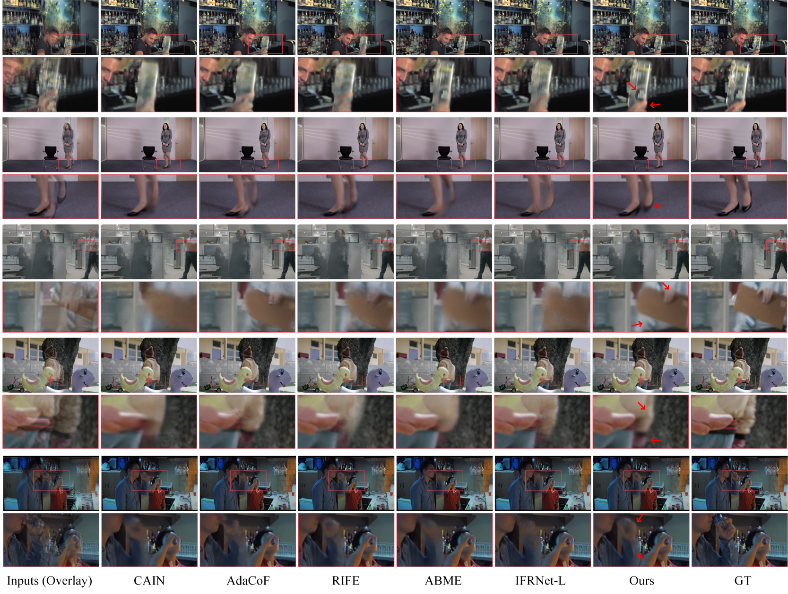

# FGDCN: Flow Guidance Deformable Compensation Network for Video Frame Interpolation

## Highlights
Motion-based video frame interpolation (VFI) methods have made remarkable progress with the development of deep convolutional networks over the past years. While their performance is often jeopardized by the inaccuracy of flow map estimation, especially in the case of large motion and occlusion. In this paper, we propose a flow guidance deformable compensation network (FGDCN) to overcome the drawbacks of existing motion-based methods. FGDCN decomposes the frame sampling process into two steps: a flow step and a deformation step. Specifically, the flow step utilizes a coarse-to-fine flow estimation network to directly estimate the intermediate flows and synthesizes an anchor frame simultaneously. To ensure the accuracy of the estimated flow, a distillation loss and a task-oriented loss are jointly employed in this step. Under the guidance of the flow priors learned in step one, the deformation step designs a pyramid deformable compensation network to compensate for the missing details of the flow step. In addition, a pyramid loss is proposed to supervise the model in both the image and frequency domains. Experimental results show that the proposed algorithm achieves excellent performance on various datasets with fewer parameters.

## Qualitative Comparison for 2x frame interpolation on Vimeo90K test set

## Qualitative Comparison for 2x frame interpolation on SNU_FILM test set

## Video demos
We test our model on Adobe240 testset. The original videos are 240FPS. For testing our model, we first downsample them to 30FPS and then use our methods to restore them. 

Figures from left to right are the input videos with **30FPS**, interpolation videos with **60FPS, 120FPS and 240FPS**, respectively.

  
  
  
  

  
  
  
  

Once our paper is accepted, we will release our code!

